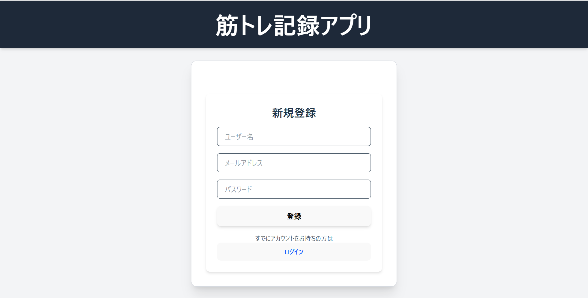
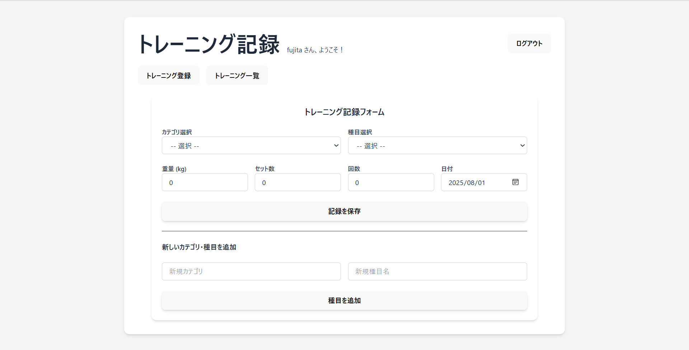
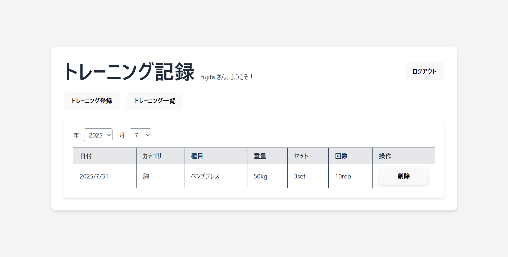

# トレーニング記録アプリ

## 概要
このアプリは、ユーザーが筋トレの記録を簡単に登録・一覧・削除できるWebアプリです。

- フロントエンド: React + TypeScript + Tailwind CSS
- バックエンド: Spring Boot + MySQL
- ユーザー認証: Spring Security（簡易）
- 記録の月別表示・種目登録などの機能あり

## 画面イメージ

### ログイン画面

### 新規ユーザー登録画面

### トレーニング登録画面

### トレーニング一覧画面

## ディレクトリ構成

trainingapp/
├── backend/    # Spring Boot APIサーバー
├── frontend/   # React フロントエンド